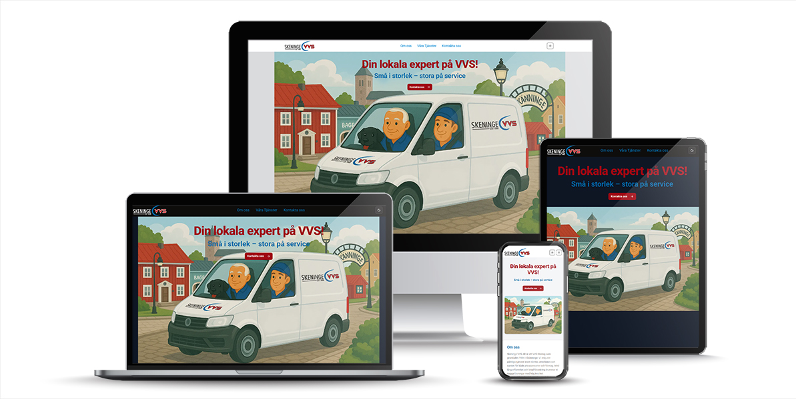
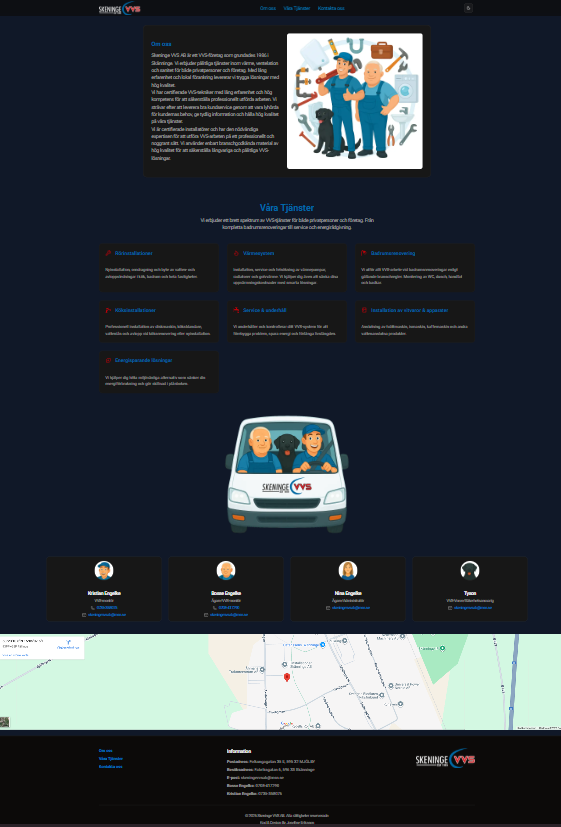
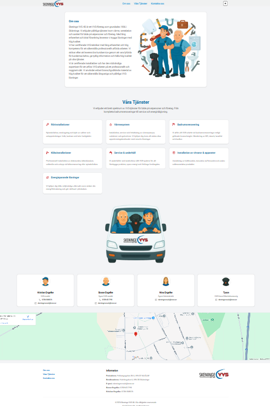
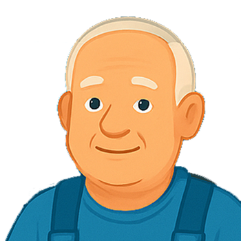
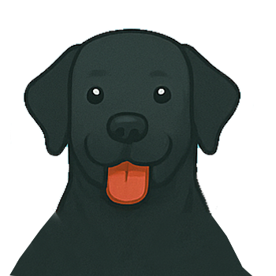
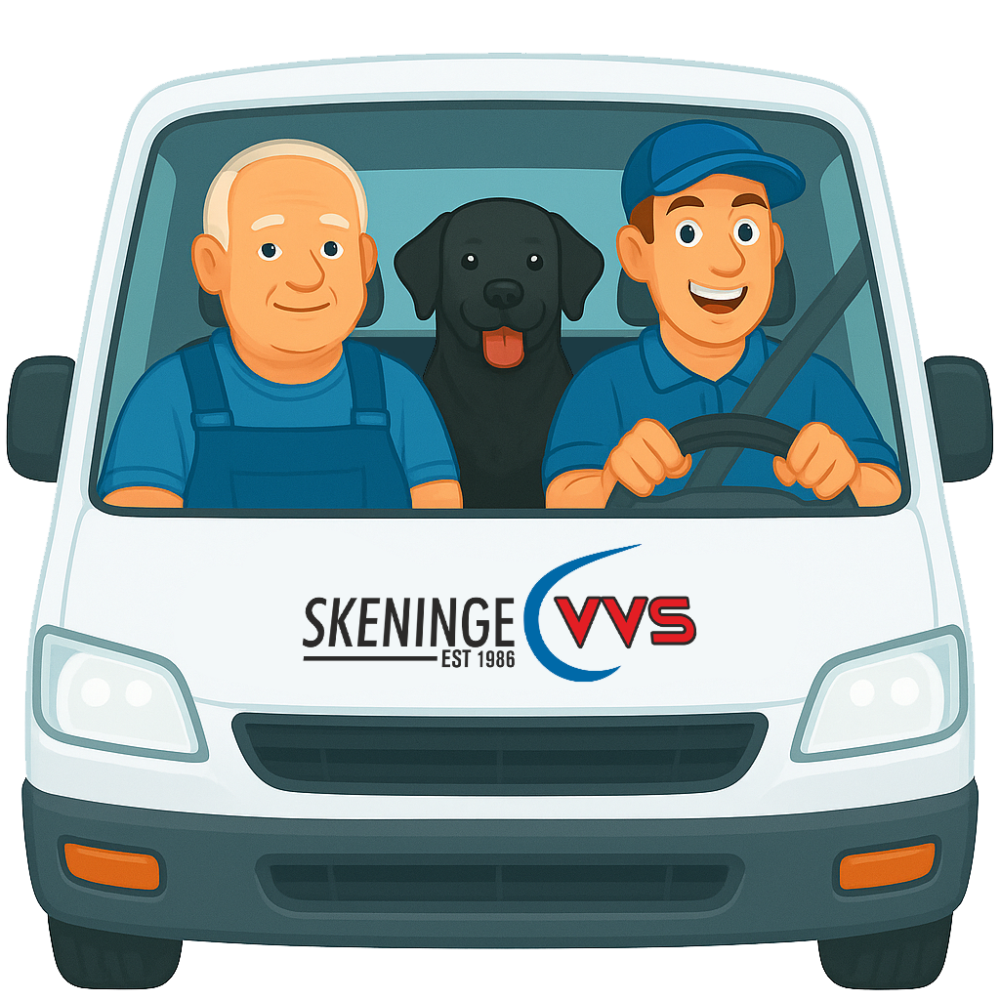
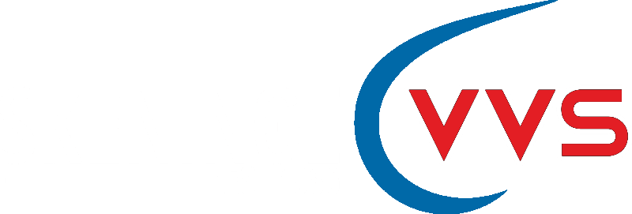

# 💧 Skeninge VVS AB – Personlig hemsida

En modern, responsiv och personlig hemsida för **Skeninge VVS AB**, ett familjeägt VVS-företag i Skänninge med lång erfarenhet av rörinstallationer, badrumsrenoveringar och värmesystem.

Byggd med **Next.js 13 (App Router)**, **TypeScript**, **Tailwind CSS** och **shadcn/ui** för att skapa en stilren, användarvänlig och lättnavigerad webbplats.

---

## 🚀 Funktioner

- **Responsiv design** – fungerar sömlöst på mobil, surfplatta och desktop
- **Ljust & mörkt tema** – via `next-themes`, anpassar sig automatiskt efter systeminställning
- **Modern UI** – tillgängliga och estetiskt tilltalande komponenter via `shadcn/ui`
- **Startsida med hero-sektion** – tydligt budskap och Call To Action (CTA)
- **Om oss** – företagets historia, värderingar och expertis
- **Tjänster** – ikonbaserade kort som beskriver VVS-tjänsterna
- **Kontakt** – personalpresentation med bilder, telefonnummer & e-postadresser
- **Google Maps-integration** – visar besöksadress direkt på sidan
- **Footer** – logotyp, adress och kontaktinfo samlad
- **SEO-optimerad** – metadata, OpenGraph och beskrivningar för bättre synlighet

---

## 🖼️ Bilder & Mockups

### Mockup



### Exempelbilder

  


### Företagsbilder

| Bosse                             | Kristian                                | Nina                            |
| --------------------------------- | --------------------------------------- | ------------------------------- |
|  |  |  |

| Tyson                             | Buss 1                                           | Buss 2                                         |
| --------------------------------- | ------------------------------------------------ | ---------------------------------------------- |
|  |  |  |

---

## 📂 Filstruktur (förenklad översikt)

```bash
.
├── public/
│   ├── images/
│   │   ├── bosse.png
│   │   ├── kristian.png
│   │   ├── kristiantysonbosse.png
│   │   ├── nina.png
│   │   ├── skeningebuss2.png
│   │   ├── skeningevvs-frontbuss.png
│   │   ├── skeningevvs-vit.png
│   │   ├── skeningevvs.png
│   │   └── tyson.png
│   ├── image1.png
│   ├── image2.png
│   └── mockup-skeningevvs.jpg
├── src/
│   ├── app/
│   │   ├── favicon.ico
│   │   ├── globals.css
│   │   ├── head.tsx
│   │   ├── layout.tsx
│   │   └── page.tsx
│   ├── components/
│   │   ├── ui/
│   │   ├── about.tsx
│   │   ├── contact.tsx
│   │   ├── footer.tsx
│   │   ├── hero.tsx
│   │   ├── Logo.tsx
│   │   ├── navbar.tsx
│   │   ├── services.tsx
│   │   ├── theme-provider.tsx
│   │   └── toggle-theme-button.tsx
│   └── lib/
├── .gitignore
├── components.json
├── eslint.config.mjs
├── next-env.d.ts
├── next.config.ts
├── package-lock.json
├── package.json
├── postcss.config.mjs
├── README.md
└── tsconfig.json
🛠️ Teknisk stack
Next.js 13 (App Router) – SSR & statisk generering

TypeScript – typsäker och robust kodutveckling

Tailwind CSS – utility-first CSS för snabb styling

shadcn/ui – tillgängliga & anpassningsbara UI-komponenter

Lucide Icons – ikonbibliotek

next-themes – hantering av mörkt/ljust tema

Google Maps Embed – integrerad karta

⚙️ Installation & Utveckling
1. Klona projektet
bash
Kopiera kod
git clone https://github.com/knixan/skeningevvsab.git
cd skeningevvsab
2. Installera beroenden
bash
Kopiera kod
npm install
3. Starta utvecklingsservern
bash
Kopiera kod
npm run dev
4. Öppna i webbläsaren
arduino
Kopiera kod
http://localhost:3000
🌍 Live-demo
👉 https://skeningevvs.se

👩‍💻 Utvecklare
Josefine Eriksson
Fullstack utvecklare, Grafisk/Webbdesigner & UI/UX Designer
🌐 https://kodochdesign.se
```
